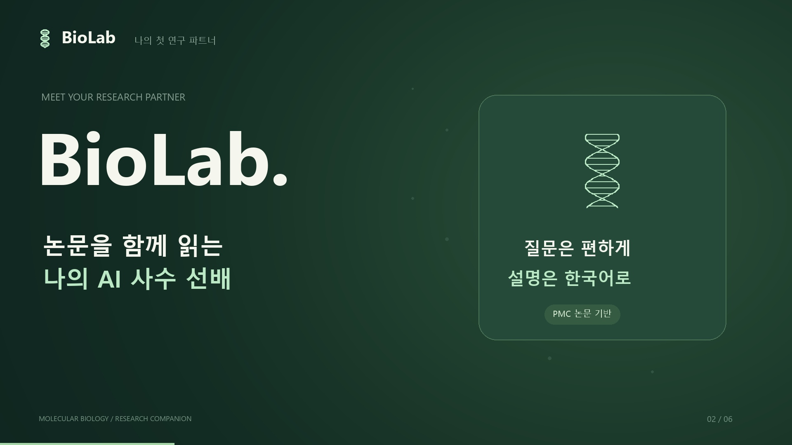

# BioLab · 나의 첫 연구 파트너

분자생물학 석사 신입생을 위한 논문 기반 AI 연구 도우미입니다. PubMed Central의 논문 Methods를 검색하고, 출처를 표시하며 한국어로 설명합니다. **임베딩과 LLM 추론은 사용자의 컴퓨터에서 실행**합니다.

## 30초 소개 영상

[](promo/output/BioLab-promo-30s-1080p.mp4)

[영상 보기](promo/output/BioLab-promo-30s-1080p.mp4) · [자막](promo/output/biolab-ko.srt)  
영상의 대화와 논문 카드는 기능 소개를 위한 연출입니다.

## 주요 기능

- 한국어 질문을 영어 논문 검색문으로 정리하고 Methods 근거를 찾아 답변
- 토큰 단위 스트리밍, PMCID 출처 표시, 논문 원문 링크
- 세션별 대화 저장·삭제·Markdown 내보내기
- 논문 라이브러리 검색과 원문 Methods 열람
- 로컬 Ollama와 Chroma 인덱스 상태 표시

브라우저 → Next.js → Django → 로컬 BGE/Chroma 검색 → 로컬 Ollama 생성 순서로 동작합니다. 코드 저장소만 공개하면 다른 사람이 사용할 서버가 자동 생성되지는 않습니다.

## 먼저 알아둘 점

**이 저장소에는 논문 전문, 전처리 JSON, 벡터 DB, 모델 파일, 개인 설정, 대화 기록을 넣지 않았습니다.** 클론 직후 논문 라이브러리는 비어 있습니다. 아래 절차로 각자 사용하려는 논문을 가져와 인덱스를 구축하세요.

프로젝트의 MIT 라이선스는 이 저장소의 코드와 직접 제작한 홍보물에 적용됩니다. 이후 사용자가 다운로드하는 논문은 각 논문의 라이선스가 적용됩니다. 예시 수집 명령은 재배포 조건을 확인하기 쉽도록 CC BY 4.0 논문만 로컬에 저장합니다. 논문을 다른 저장소에 재배포하려면 저자·출처·라이선스 표시 의무를 별도로 이행하세요.

## 설치

Python 3.11~3.13, Node.js 20.9 이상, Ollama가 필요합니다. 예시는 Windows PowerShell이며 프로젝트 루트에서 실행합니다.

```powershell
# Python 가상환경이 없다면 생성
uv venv .venv --python 3.13
uv pip install --python .\.venv\Scripts\python.exe -r requirements.txt
if (-not (Test-Path .env)) { Copy-Item .env.example .env }
.\.venv\Scripts\python.exe backend/manage.py migrate

cd frontend
npm.cmd ci
cd ..
```

`.env`에 **본인의** `NCBI_EMAIL`을 입력하세요. API 키는 선택 사항입니다. 실제 비밀값은 Git에 올리지 마세요.

Ollama를 실행하고 기본 모델을 준비합니다. 모델 크기와 실행 속도는 컴퓨터 사양에 따라 다릅니다.

```powershell
ollama pull lancard/korean-yanolja-eeve
# Ollama 앱이 이미 실행 중이면 다음 명령은 생략
ollama serve
```

다른 터미널에서 PMC 검색 결과를 공식 OAI-PMH 전문 제공 API로 가져오고, Methods를 인덱싱합니다.

```powershell
.\.venv\Scripts\python.exe -m biolab.collect --query "molecular biology transfection" --limit 15
.\.venv\Scripts\python.exe -m biolab.preprocess
.\.venv\Scripts\python.exe -m biolab.index --download-model
```

최초 모델 다운로드와 논문 수집에는 인터넷이 필요합니다. `--download-model`은 최초 한 번만 사용하고, 이후에는 `python -m biolab.index`로 갱신할 수 있습니다. 수집기에서 CC BY 4.0 전문을 찾지 못하면 0편이 저장될 수 있으므로 다른 검색어를 사용하세요. 데이터 파일과 로컬 인덱스는 `.gitignore`에 포함되어 있습니다.

## 실행

터미널 A:

```powershell
.\.venv\Scripts\python.exe backend/manage.py runserver 127.0.0.1:8000
```

터미널 B:

```powershell
cd frontend
npm.cmd run dev
```

브라우저에서 **http://127.0.0.1:3000**을 여세요. 기본 설정은 개인 PC에서 사용하는 단일 사용자 앱입니다. 인터넷 공개 서버로 운영하려면 인증·HTTPS·영구 저장소·배포 설정과 자원 제한을 별도로 준비해야 합니다.

## 검사

```powershell
.\.venv\Scripts\python.exe backend/manage.py test research
.\.venv\Scripts\python.exe backend/manage.py check
cd frontend
npm.cmd run typecheck
npm.cmd run build
```

실제 논문을 수집해 인덱스를 만든 뒤 두 서버가 실행 중이면 루트에서 `scripts/smoke_test.py --live`로 로컬 Ollama까지 연결을 확인할 수 있습니다.

## 구조

| 경로 | 역할 |
| --- | --- |
| `frontend/` | Next.js 연구 대화·논문 라이브러리 |
| `backend/` | Django API와 세션별 대화 기록 |
| `biolab/collect.py` | PMC 검색과 OAI-PMH 전문 수집 |
| `biolab/preprocess.py` | Methods 정제 및 청킹 |
| `biolab/index.py`, `biolab/rag.py` | Chroma 임베딩·검색·로컬 생성 |
| `promo/` | 공개용 연출 영상과 재생성 소스 |

### 데이터 출처와 이용 조건

PMC는 논문마다 저작권과 이용 조건이 다르다고 안내합니다. CC BY 4.0 자료도 저자와 출처, 라이선스 링크를 표시해야 합니다. 코드와 논문 자료에 하나의 MIT 라이선스를 적용하지 마세요. [PMC 저작권 안내](https://pmc.ncbi.nlm.nih.gov/about/copyright/) · [PMC OAI-PMH API](https://pmc.ncbi.nlm.nih.gov/tools/oai/) · [CC BY 4.0](https://creativecommons.org/licenses/by/4.0/)
